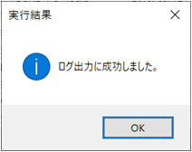

# MySQLログ挿入ツール（WindowsApp）

 (Win開発者支援) MySQLのログ用テーブルにレコードを挿入するツール　

**目次**
<!-- vscode-markdown-toc -->
 1. [動作環境](#1)
 2. [機能仕様](#2)
 3. [入手方法](#3)
 4. [使い方](#4)
 5. [よくあるご質問（FAQ）](#5)
 6. [更新履歴](#6)
 <!-- 7. [残対応](#7) -->

<!-- vscode-markdown-toc-config
	numbering=true
	autoSave=true
	/vscode-markdown-toc-config -->
<!-- /vscode-markdown-toc -->
 

##  1. 動作環境

|対象OS|前提条件|備考|
|--|--|--|
|Windows10|||

##  2. 機能仕様

|機能|説明|備考|
|--|--|--|
|レコード挿入|ログテーブルにログ用レコードを1件挿入 （※ログテーブルは存在しなければ自動生成します）||
|レコード参照|実行後にログテーブルのレコードを参照||

##  3. 入手方法

1. 画面右上の「Download」ボタンからツール本体をダウンロードします。
2. デスクトップなど自分のわかりやすい位置に配置します。

<!-- 

 -->

##  4. 使い方

1. ツールを起動します。（\bin\Release\WriteLog.exe）

1. MySQL接続先の情報を入力します。レコード挿入先のログテーブル名を入力します。入力後、「接続＆ログ出力」ボタンをクリックします。

1. 実行完了後、以下のメッセージが表示されます。 

1. レコード挿入結果は、 画面右側の「ログ出力先テーブル」に表示されます。※日付の昇順で表示されます

##  5. よくあるご質問（FAQ）

> レコードのデータがすべて表示されていません

規定値として、最大1万件まで表示しています。

##  6. 更新履歴
|バージョン|更新日|更新内容|更新者|
|--|--|--|--|
|1.0.0.0|2019/05/12|初版公開|Agure|
